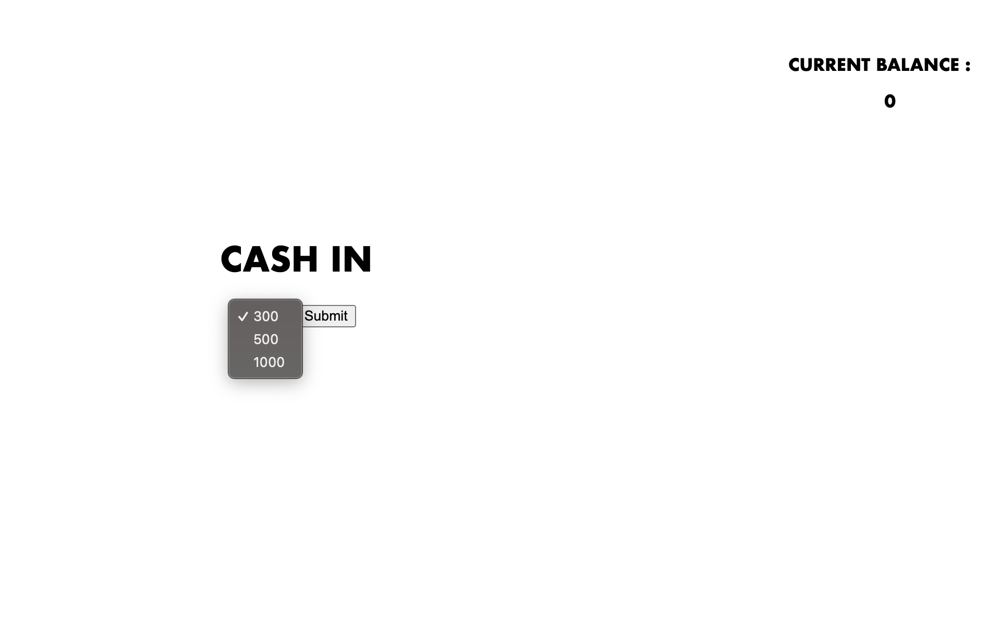
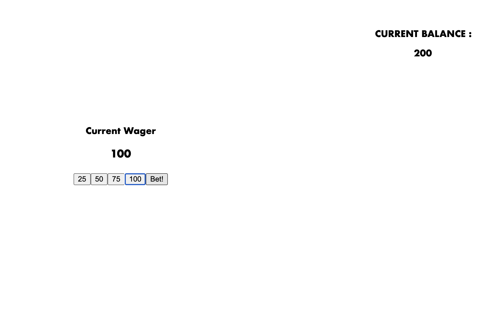

## Blackjack

Try it out here!
https://marklimjr.github.io/u1_blackjack_ga/

## Game Description

Blackjack is a cardgame where the player plays against the dealer to reach a card score of 21. Both sides are dealt with 2 cards to start and require a minimum value of 16 and a maximum of 21.

Both cards are dealt open to the player while one of the dealer's card is hidden. The player has to draw a card if his current hand is less than 16. Else, the player can draw cards in an attempt to get a higher number, but loses if the value exceeds 21.

The game has a wagering system where the wager is casted prior to the hands being dealt. When the player wins, the wager amount is deposited into the balance. If the player loses, the wager is lost to the house.

## Screenshots of Game

Cash In page

Choosing Wager

Player options to Hit or Stand

Player Win/Lose - play again option

## Tools Used

JavaScript
HTML
CSS

## Player Experience

Instructions:

1. Player is presented to the "Cash In" page, where they chooses the amount they want the total wager amount they want to start with.

2. The player is brought to the wagering page. They decided how much they want to wager for the round. Similar to stacking chips, the user can click the wager value multiple times and in various combinations to set the bet. The page will only proceed if there is a wager presented in the input box.

3. Player and Dealer are dealt their starting hand. If the player's hand value is less than 16, the only option available is to hit for a new card. If the player is satisfied with their hand, they can click "stand" and the dealer's turn is prompted.

4. The dealer will draw cards till it firstly have a value of 16, then it'll try to beat the player's hand.

5. If the player has a higher value than the dealer and does not go over 21, they will win the round. If the player draws a blackjack combination, which is a picture card and an Ace, they automatically win. The also player wins if the dealer draws a value over 21.

## Primary Challenges

1. Converting a card deck into values

My initial approach was to create an array of 4 arrays with values 1-13, with each array representing a card suite and each value representing a card. With each draw from the deck, the value will be removed from the array with the intention of not having a repeat card in the draw.

However this proved to be a chokepoint as everytime an element is removed, the method of a random draw via array[randomvalue][randomvalue] may catch a value that is shifted down because of the removal method, and thus not be accurate.

The game currently runs without the array deck so it is still prone to repeat cards. But for now the game is framed to be a multi deck stack...

2. Converting picture cards into values of 10 or blackjack win conditions

The picture cards of Jack Queen and King provied to be an issue when tabulating the player ande dealer's hand values as they can represent various values at one time. They are seperated into two checks, one that converts them in to values of ten, and the other comparing it to an ace to check for an auto win.

The element of an Ace being a floating value on the first hand has yet to be solved, where the ace can represent the value of 1 or 10 when the other card is not a picture card.

3. Looping of gameplay when round ends.

As the code is constructed to have multiple game states, the start, the wager stage and the card screen, an approach is required to shuffle between screens while maintaining certain values such as the current balance while reseting other values such as the card and wager values.

Initially I thought I could use the css.style.display to show and hide the screens, however most of the buttons were generated when a page is rendered. That required me to backtrack and lookout for all the elements that were created via JS and remove them before re-rendering a page. That resulted in long chunky code of looking for an element and removing them individually which could've been cut shorter with better HTML planning.

## Key Learnings

1. My approach to this project was to create the game using the knowledge I retained of manipulating functions and arrays. I ended up spending more time figuring out simpler functions that could've been fixed with a quick search.

2. To plan out early on what are crucial values that stay outside in the global scope and also understand how to draw values from various stages and understand where they go.

3. Do the HTML pages along the way as trying to attach all of them later usually gets messy

4. gotta copy till you are good enough to understand what you copy
